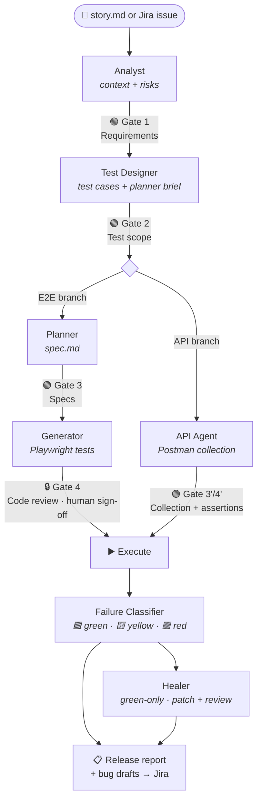
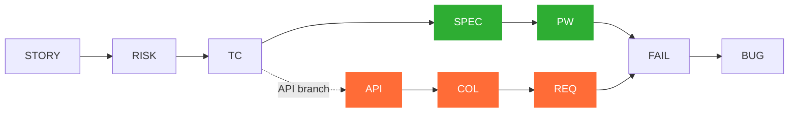

<div align="center">

# Qaizen

**Agile-aligned QA where Artificial Intelligence and Human judgment work in balance.**

[](https://github.com/MiltonKlun/Qaizen/actions/workflows/qa-pipeline.yml)


</div>

> _Kaizen_ (改善, "change for better"): continuous improvement through small,
> concrete steps, where people and system are inseparable — neither improves
> without the other.

You give it a story (from Jira or a local `story.md`); it produces validated
test cases, Playwright E2E specs and tests, Postman/Newman API checks, a
classified failure analysis, a release report, and bug drafts ready to file.
**Four human-in-the-loop gates** sit between the steps — the human signs off at
each one, and the final code review is always a human decision that no flag,
script, or CI job can pass.

> This is **not** an autonomous/vibecoding agent. It makes a QA engineer more agile, not absent.

---

## ❓ Why it exists

Asking an AI to "write Playwright tests for this story" gets you a plausible
answer fast. Qaizen gets you a _trustworthy_ one — and turns that trust into
artifacts you can ship, audit, and hand to your board. Four things you get that
raw prompting doesn't:

| | You gain | What it means |
| --- | --- | --- |
| 🧾 | **Auditability** | Every artifact is schema-validated and every gate decision is recorded with telemetry — you can prove _why_ a release was signed off. |
| 🔗 | **Traceability** | An unbroken chain from story → risk → test case → test → failure → bug, so nothing tested is unexplained and nothing important is silently untested. |
| 🎭 | **Tests you can trust** | Tests are written against the _running app_ (via Playwright MCP), so a green run means the feature actually works — not that the AI guessed well from the story text. |
| 🛡️ | **Guardrails that hold** | The auto-healer fixes a broken selector for you, but can never weaken, skip, or delete a test — your suite only gets stronger, never quietly hollowed out. |

The payoff is confidence: faster test creation _and_ a paper trail that stands
up to review. When a change is too small to deserve it (a throwaway script, a
one-line tweak), prompting the AI directly is the honest call —
see [docs/when-to-use.md](docs/when-to-use.md).

---

## 🚪 Quickstart — 3 Doors

You don't need the whole pipeline to get value. Pick a door:

```bash
npm install

# 1. SEE IT — a 10-minute, fully offline, deterministic walkthrough of all
#    four gates and the FAIL → bug-draft → release-report chain.
npm run demo:pipeline

# 2. USE ONE PIECE — adopt a single capability (no full flow). 
# - See the standalone one-pagers under docs/standalone-*.md.

# 3. RUN THE PIPELINE — drive a real story through the four gates.
npm run pipeline -- --story <path-to-story.md | JIRA-KEY>
```

[docs/when-to-use.md](docs/when-to-use.md) helps you decide which door fits a given story.

---

## ⚙️ How it works

A story flows through five stages, gated by four human checkpoints. AI agents do
the heavy lifting; humans approve at each gate.



> 🟢 = recorded human gate · 🔒 = always a human decision (never automatable)

---

### The 4 Gates

| Gate | After | Human checks |
| --- | --- | --- |
| **1. Requirements** | Analyst | ACs accurate, risks meaningful, no invented rules |
| **2. Test scope** | Test Designer | Coverage, priorities, automation decisions justified |
| **3. Specs** | Planner | Specs match scope, negative cases present |
| **4. Code** | Generator | Stable locators, real assertions, no skipped/weakened tests — always a human sign-off |

---

### Traceability chain

Every artifact locates itself here; a link that can't be made is recorded as
\`traceability_unresolved\`, never faked:



---

### Tech stack

| Layer | Pieces |
| --- | --- |
| 🧱 **Discipline** | JSON Schemas + AJV · traceability IDs · folder ownership · four human gates · Architecture Stability Rule |
| 🤖 **Custom agents** | analyst · test-designer · api-agent · failure-classifier · reporter · spec-reviewer |
| 🎭 **Playwright Native Agents** | planner · generator · healer |
| 🔌 **Official MCPs** _(reused, never rewritten)_ | Atlassian (Jira) · Playwright · Postman · TestLink |
| 🛠️ **Runtime** | Node 20+ · TypeScript (strict) · Playwright 1.56+ · Newman · ESLint · Prettier · GitHub Actions CI |

---

## 📟 Commands

| Command | What it does |
| --- | --- |
| `npm run pipeline -- --story <ref>\` | Drive a story through the four gates (the runner) |
| `npm run demo:pipeline\` | Offline 10-minute demo of the full flow |
| `npm test\` | Run the generated Playwright E2E suite |
| `npm run test:api\` | Run the Postman collections via Newman |
| `npm run classify\` | Rule-based failure classification (🟩 / 🟨 / 🟥) |
| `npm run heal\` | Guardrailed healer — produces reviewable patches, never commits |
| `npm run metrics\` | Aggregate pipeline metrics from run history |
| `npm run validate:all\` | Validate every committed artifact against its schema |
| `npm run scan:gate4 -- <spec>\` | Static pre-Gate-4 scan (assists review) |
| `npm run evolve\` | Propose scored, evidence-backed improvements (never applies them) |
| `npm run session-summary -- --friction "..."\` | Capture run friction for the next `/evolve` |

Standalone capabilities (adopt one piece without the whole pipeline):
[failure classifier](docs/standalone-failure-classifier.md) ·
[healer](docs/standalone-healer.md) ·
[test designer](docs/standalone-test-designer.md).

---

## 🗂️ Repository layout

| Path | Contents |
| --- | --- |
| `agents` | Custom agent prompts (analyst, test-designer, reporter, …) |
| `skills` | Lifecycle skills adapted from \`dogkeeper886/ai-qa-workflow\` |
| `schemas` | JSON Schema contracts for every artifact (AJV-validated) |
| `scripts` | The runner, validators, classifier, healer, metrics, demo |
| `docs` | Architecture, gates, traceability, integration & fit guides |
| `examples` | Example stories, expected outputs, the offline demo fixtures |
| `tests` · `api-tests` | Generated Playwright tests · Postman collections |
| `runs` | Archived run history (one snapshot per story run) |
| `.github/workflows` | CI: quality gate (blocking) + informational jobs |

---

## 📐 Key design choices

- **Reuse before building** — official MCPs and Playwright Native Agents over
  custom code; this cut bespoke code by roughly half.
- **Schemas are contracts** — a schema change must move with its agent prompts,
  docs, and examples in one PR (the _Architecture Stability Rule_).
- **Healer guardrails** — 🟩 Green (auto-fix as a reviewable patch) / 🟨 Yellow
  (suggest only) / 🟥 Red (bug draft only, never touched). Always: never change
  an expected value, delete a test, or add \`.skip\`.
- **Tiered ceremony** — a \`lite\` track for routine work, with a principled floor
  that refuses \`lite\` for money/security/permissions/data stories.
- **Out of scope by design** — no autonomous gate approval, no n8n, no web
  dashboard, no DB/queue. See [docs/deferred.md](docs/deferred.md) for what's
  deferred (with triggers) vs. permanently rejected.

---

## 🔄 Continuous improvement — `/evolve`

Over time any project drifts from its own design: a step meant to be automatic
gets done by hand every run, a doc describes a flag the code no longer has, the
same kind of bug lands three sprints in a row. `/evolve` is the scheduled moment
to **notice that drift on purpose** and decide what to do about it.

It is a script (`npm run evolve`) that reads signals about how the pipeline is
really being used, groups them into themes, scores each by how often it
recurred, and writes a proposal.

> [!IMPORTANT]
> `/evolve` **proposes, it never changes anything.** It will not edit a prompt,
> schema, doc, or script — a human reads the proposal and decides. Same
> philosophy as the rest of Qaizen: the machine gathers and scores; the human
> judges.

**What it reads** _(each source optional, skipped silently if absent)_:

| Source | What it tells `/evolve` |
| --- | --- |
| 📈 Git commits/merges (90d) | Where effort concentrated; recurring fix/revert/recover themes (churn) |
| 📊 `metrics/pipeline-metrics.json` | Untested high-risk items, prompt-stability status (run `npm run metrics` first) |
| 📝 `session-summaries/*.md` | **Highest signal** — friction in your own words, captured right after a run |

**How it scores** _(deterministic — occurrence counts, not opinion)_: a theme
seen **3+ times** is a 🔴 high-confidence finding, 2× is 🟡 medium, 1× is ⚪ low.
It surfaces _systemic_ friction, not one-offs.

**How to use it:**

```bash
# 1. Capture fresh friction right after a run (the highest-leverage habit):
npm run session-summary -- --friction "what rubbed" --note "what worked"

# 2. Refresh metrics (one of evolve's inputs):
npm run metrics

# 3. Run it, then read evolve/evolve-proposal.md (🔴 findings first):
npm run evolve
```

For each finding you **Accept** (make the change at the named target, with the
right discipline), **Defer** (it resurfaces next run if it's real), or **Reject**
(note why, so it isn't re-litigated). Run it every ~90 days or ~10 runs, or
right after a session while friction is fresh. See
[docs/evolve-loop.md](docs/evolve-loop.md).

---

## 📚 Documentation

- **[STRATEGY.md](STRATEGY.md)** — one-page "what this is and the question it answers."
- **[docs/when-to-use.md](docs/when-to-use.md)** — honest fit / don't-fit guide.
- **[docs/pipeline-runner.md](docs/pipeline-runner.md)** — how to drive the runner.
- **[docs/review-gates.md](docs/review-gates.md)** — the four gates in detail.
- **[docs/pipeline-architecture.md](docs/pipeline-architecture.md)** — the full architecture.
- **[docs/traceability.md](docs/traceability.md)** · **[docs/healer-guardrails.md](docs/healer-guardrails.md)** · **[docs/automation-decision-model.md](docs/automation-decision-model.md)**
- **[docs/evolve-loop.md](docs/evolve-loop.md)** — the `/evolve` continuous-improvement loop.
- **[CLAUDE.md](CLAUDE.md)** — operating instructions for an AI agent working in this repo.

---

## 📄 License

[MIT](LICENSE) © Milton Klun — free to use, modify, and distribute, for
commercial and non-commercial purposes alike.
