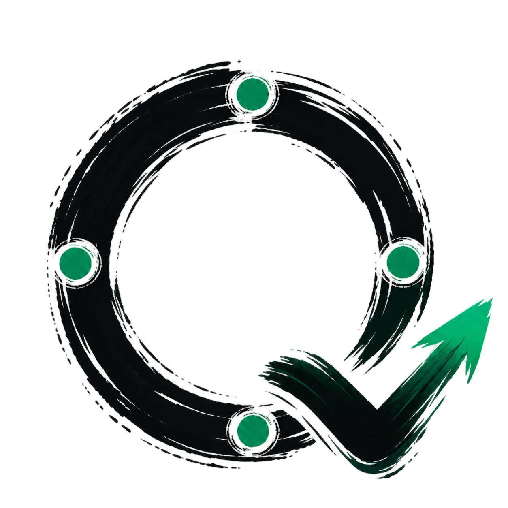
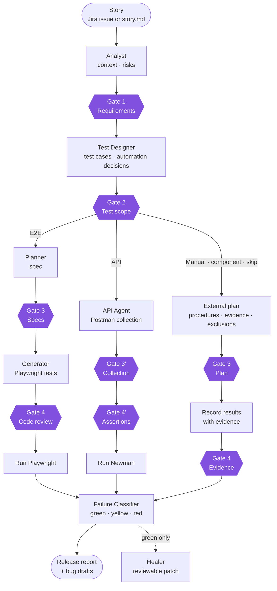
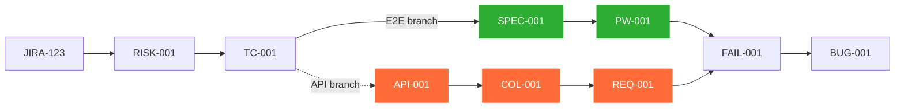

<div align="center">

<picture>
  <source media="(prefers-color-scheme: dark)" srcset="docs/assets/Qaizen_logo_dark.png">
  
</picture>

# Qaizen

**AI does the QA legwork. You make the calls.**

[](https://github.com/MiltonKlun/Qaizen/actions/workflows/qa-pipeline.yml)
[](package.json)
[](package.json)
[](LICENSE)

</div>

Give Qaizen a user story (a Jira issue or a `story.md`) and it produces
validated test cases, Playwright E2E tests, Postman/Newman API checks, a
classified failure analysis, a release report and ready-to-file bug drafts.
**Human gates** sit between the stages: nothing moves past one until a person
approves it, and the runner has no way to approve from a flag, script or CI job.

> QA + _kaizen_ (改善, "change for the better"): small steps, with people and
> system improving together. Qaizen makes a QA engineer faster, not absent.

---

## Why it exists

Asking an AI to "write Playwright tests for this story" gets a plausible answer
fast. Qaizen gets a _trustworthy_ one:

| You get | Because |
| --- | --- |
| **Traceability** | Every test links back to a risk and a story, and every failure forward to a bug, so nothing is tested without a reason or left out unnoticed. |
| **Auditability** | Every artifact is schema-validated and every gate decision recorded, so you can show _why_ a release was signed off. |
| **Guardrails that hold** | A proposed fix is re-run in isolation and handed to you as a patch; nothing that weakens, skips or deletes a test gets through. |
| **Tests grounded in the app** | Tests are written against the running app (Playwright MCP), not guessed from the story text. |

A capable agent can ground itself, but it won't gate, trace or record itself;
that is what the pipeline adds ([evidence](docs/evidence.md)). For a throwaway
script or a one-line change, prompting an AI directly is the honest call
([when to use it](docs/when-to-use.md)).

---

## Quickstart: 3 doors

```bash
npm install

# 1. See it: an offline, deterministic walkthrough of every gate and the
#    failure -> bug draft -> release report chain (~10 minutes).
npm run demo:pipeline

# 2. Use one piece: the failure classifier, healer or test designer on its own
#    (docs/standalone-*.md).

# 3. Run it: drive a real story through the gates.
npm run pipeline -- --story <path-to-story.md | JIRA-KEY>
```

---

## How it works

AI agents do the work; the purple steps are human decisions.


```mermaid
flowchart TD
    story([Story<br/>Jira issue or story.md]) --> analyst[Analyst<br/>context · risks]
    analyst --> g1{{Gate 1<br/>Requirements}}
    g1 --> designer[Test Designer<br/>test cases · automation decisions]
    designer --> g2{{Gate 2<br/>Test scope}}

    g2 -->|E2E| planner[Planner<br/>spec] --> g3{{Gate 3<br/>Specs}}
    g3 --> generator[Generator<br/>Playwright tests] --> g4{{Gate 4<br/>Code review}}
    g4 --> pw[Run Playwright]

    g2 -->|API| apiagent[API Agent<br/>Postman collection] --> g3a{{Gate 3′<br/>Collection}}
    g3a --> g4a{{Gate 4′<br/>Assertions}} --> nm[Run Newman]

    g2 -->|Manual · component · skip| plan[External plan<br/>procedures · evidence · exclusions]
    plan --> g3e{{Gate 3<br/>Plan}} --> rec[Record results<br/>with evidence] --> g4e{{Gate 4<br/>Evidence}}

    pw --> classify[Failure Classifier<br/>green · yellow · red]
    nm --> classify
    g4e --> classify
    classify --> report([Release report<br/>+ bug drafts])
    classify -. green only .-> healer[Healer<br/>reviewable patch]

    classDef gate fill:#8250df,stroke:#8250df,color:#fff
    class g1,g2,g3,g4,g3a,g4a,g3e,g4e gate
```

| Gate | After | The human checks |
| --- | --- | --- |
| **1. Requirements** | Analyst | Acceptance criteria accurate, risks meaningful, no invented rules |
| **2. Test scope** | Test Designer | Coverage, priorities, and each automation decision justified |
| **3. Specs** | Planner | Specs match the approved scope, negative cases present |
| **4. Code** | Generator | Stable locators, real assertions, nothing skipped or weakened |

Each branch has its own Gate 3 and Gate 4; one branch's approval never stands in
for another's. Routine stories may take the `lite` track, where Gates 1 and 2
are one decision; a story that touches payments, permissions, security or data
integrity, or is too large to be routine, always gets all four
([review gates](docs/review-gates.md)).

**Traceability.** Every artifact carries its place in the chain; a link that
can't be proven is recorded as `traceability_unresolved`, never faked.


```mermaid
flowchart LR
    STORY[JIRA-123] --> RISK[RISK-001] --> TC[TC-001]
    TC -- E2E branch --> SPEC[SPEC-001] --> PW[PW-001] --> FAIL[FAIL-001] --> BUG[BUG-001]
    TC -. API branch .-> API[API-001] --> COL[COL-001] --> REQ[REQ-001] --> FAIL

    classDef e2e fill:#2ead33,stroke:#2ead33,color:#fff
    classDef api fill:#ff6c37,stroke:#ff6c37,color:#fff
    class SPEC,PW e2e
    class API,COL,REQ api
```

---

## Commands

| Command | What it does |
| --- | --- |
| `npm run pipeline -- --story <ref>` | Drive a story through the gates |
| `npm run demo:pipeline` | Offline demo of the full flow |
| `npm test` · `npm run test:api` | Run the Playwright suite · the Postman collections (Newman) |
| `npm run normalize -- --story <id> ...` | Merge runner reports into one execution ledger |
| `npm run classify` | Draft Green / Yellow / Red failure classification from the ledger |
| `npm run import:execution -- --case TC-X ...` | Record a manual or component result with its evidence |
| `npm run heal` | Healer triage; with `--failure` and `--candidate`, validate a fix into a reviewable patch |
| `npm run scan:gate4 -- <spec>` | Static pre-Gate-4 scan to assist review |
| `npm run validate:all` | Validate every committed artifact against its schema |
| `npm run metrics` · `npm run evolve` | Aggregate run metrics · propose improvements from them |

How the runner works, step by step: [docs/pipeline-runner.md](docs/pipeline-runner.md).

---

## Built from

| Layer | Pieces |
| --- | --- |
| **Discipline** | JSON Schemas + AJV · traceability IDs · folder ownership · human gates · one PR per contract change |
| **Agents** | Custom: analyst · test-designer · api-agent · failure-classifier · reporter · spec-reviewer. Playwright Native: planner · generator · healer |
| **Official MCPs** | Atlassian (Jira) · Playwright · Postman · TestLink, reused, never rewritten |
| **Runtime** | Node · TypeScript (strict) · Playwright · Newman · ESLint · Prettier · GitHub Actions |

Design choices:

- **Reuse before building.** Official MCPs and Playwright Native Agents over
  custom code.
- **Schemas are contracts.** A schema change ships with its agent prompts, docs
  and examples in the same PR.
- **Healer guardrails.** Green: a locator fix, validated into a patch for
  review. Yellow: a suggestion only. Red: a bug draft, never touched. A fix
  never changes an expected value, deletes a test or adds `.skip`.
- **Out of scope by design.** No autonomous gate approval, no n8n, no web
  dashboard, no database or queue.

---

## Repository layout

| Path | Contents |
| --- | --- |
| `agents` · `skills` | Agent prompts · lifecycle skills adapted from `dogkeeper886/ai-qa-workflow` |
| `schemas` | JSON Schema contract for every artifact |
| `scripts` | The runner, validators, classifier, healer, metrics, demo |
| `docs` | Architecture, gates, traceability, integration and fit guides |
| `examples` | Example stories, expected outputs, demo fixtures |
| `tests` · `api-tests` | Generated Playwright tests · Postman collections |
| `external-evidence` | Recorded manual and component results with their evidence |
| `test` | Unit tests for the pipeline's own scripts |
| `runs` · `evidence` | Archived run history · benchmark records |

---

## Continuous improvement

`npm run evolve` reads git history, run metrics and the friction notes you
capture after a run (`npm run session-summary -- --friction "..."`), groups
them into themes, and scores each by how often it recurs. It writes a proposal
and **changes nothing**; you accept, defer or reject each finding. See
[docs/evolve-loop.md](docs/evolve-loop.md).

---

## Documentation

- [When to use it](docs/when-to-use.md): an honest fit guide
- [Pipeline runner](docs/pipeline-runner.md) · [Review gates](docs/review-gates.md) · [Architecture](docs/pipeline-architecture.md)
- [Traceability](docs/traceability.md) · [Healer guardrails](docs/healer-guardrails.md) · [Automation decisions](docs/automation-decision-model.md)
- [Design decisions](docs/design-decisions.md) · [Evolve loop](docs/evolve-loop.md)
- [CLAUDE.md](CLAUDE.md): operating rules for an AI agent working in this repo

---

## License

[MIT](LICENSE)

## Author

**Milton Klun**  
*QA Automation Engineer · AI Quality Testing*

<div align="left">
  <a href="https://www.linkedin.com/in/milton-klun/"></a><a href="mailto:miltonericklun@gmail.com"></a><a href="https://www.miltonklun.com"></a>
</div>
